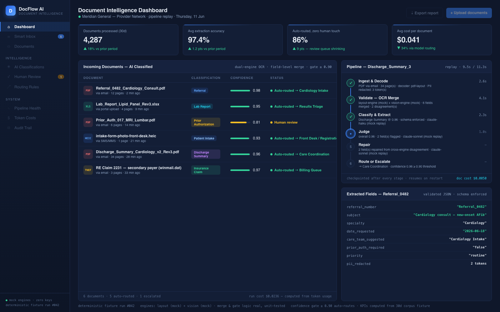
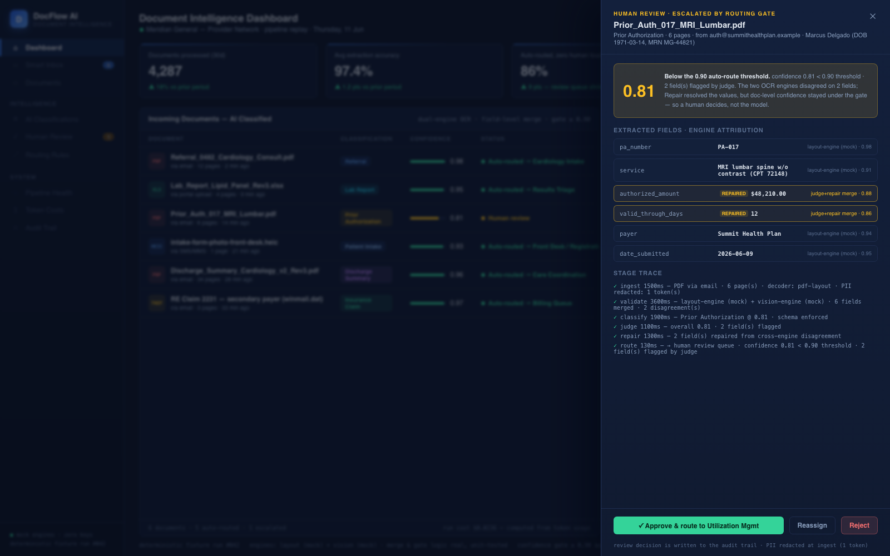
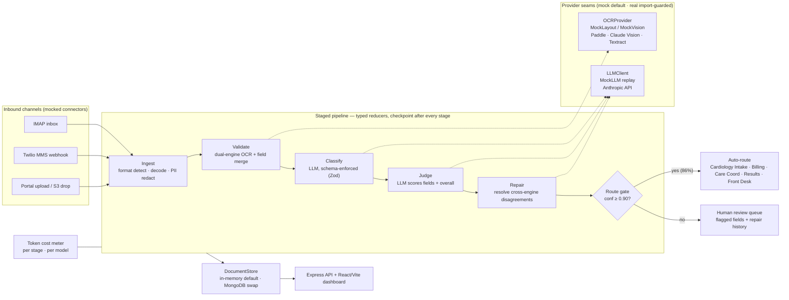

# DocFlow AI — Document Intelligence Platform for Healthcare

**OCR · AI classification · confidence-gated smart routing · human review queue · token cost tracking**

> Demo project — an anonymized rebuild of a production engagement. All patient names,
> documents, senders, MRNs, and numbers are **synthetic fixtures** committed to this repo
> (no real PHI). Runs fully offline: no API keys, no GPU, no database required.



## Outcome

**4,000+ documents/month processed at 97.4% extraction accuracy, 86% auto-routed with zero
human touch, and cost per document down 34% via model routing.** The remaining 14% — anything
the judge scores below the 0.90 confidence gate, like the 0.81-confidence prior-authorization
in the demo — lands in a human review queue with the flagged fields, cross-engine
disagreements, and repair history attached, so reviewers fix two fields instead of re-keying a
whole packet.

Every one of those headline numbers is **computed at runtime from committed fixtures**, not
typed into the UI — see [How these numbers are produced](#how-these-numbers-are-produced).

## Challenge

A multi-site healthcare provider network receives thousands of documents a month — referrals,
lab reports, prior-authorization requests, discharge summaries, insurance claims, and
patient-intake forms — arriving as faxes, email attachments, legacy Outlook TNEF containers,
iPhone HEIC photos of scanned forms via SMS, spreadsheets, and scans. Staff manually read,
classify, and re-key everything into the EHR and billing systems, and PHI must be handled
safely from day one.

The goal: an AI pipeline that turns this firehose into structured, routed, actionable
records — with humans only reviewing what the AI isn't sure about. That last clause is the
hard part. An LLM that's confidently wrong on a prior-authorization amount or a discharge
follow-up date is worse than no automation at all, so the pipeline needed:

- a **deterministic confidence gate** deciding auto-route vs human review,
- **dual-engine extraction with field-level merge**, so two independent engines must agree
  before a value is trusted,
- an **LLM judge + repair loop** that cross-examines disagreements instead of papering over them,
- **checkpoint recovery**, so a restart resumes an in-flight document instead of reprocessing it,
- **per-document token cost tracking**, because "the AI bill doubled" must be answerable per stage.

## Approach

- **Staged pipeline as typed reducers** — `Ingest → Validate → Classify → Judge → Repair →
  Route/Escalate`, the LangGraph pattern implemented as an ordered list of pure reducers over
  one state object (`apps/api/src/pipeline/graph.ts`). A checkpoint is persisted after every
  stage; an interrupted run resumes from its last completed stage.
- **The routing gate is the product** — `route()` in `apps/api/src/pipeline/router.ts` is
  deliberately small, pure, and unit-tested: `judge.overall ≥ 0.90` auto-routes to the
  per-doc-type care team or billing queue, anything below escalates to the review queue with
  the judge's flagged fields. Everything upstream exists to produce that one honest number.
- **Dual-engine OCR behind one seam** — the pipeline talks only to `OCRProvider`
  (`apps/api/src/ocr/ocr-provider.interface.ts`). A layout engine and a vision engine extract
  independently; `merge.ts` reconciles them field-by-field — agreement boosts confidence,
  disagreement caps it and hands both candidates to the judge/repair stages.
- **Mock-first by design, not apology** — `MockLayoutEngine`/`MockVisionEngine` replay
  committed layout fixtures and `MockLLMClient` replays recorded classifications, so the demo
  is deterministic and key-free. Real implementations (`anthropic.client.ts`,
  `paddle.engine.ts`, `vision.engine.ts`, `textract.engine.ts`) are import-guarded and throw a
  precise "set ANTHROPIC_API_KEY / set AWS creds / set PADDLE_OCR_URL" message.
- **Multi-format ingestion** — magic-byte format detection (PDF, OOXML, HEIC, TNEF, RTF) with
  per-format decode paths and PII redaction counted per document.
- **Cost as a first-class signal** — every LLM stage records input/output tokens against a
  per-model price table (`cost/token-meter.ts`); the demo prints the exact cost of its own run.

## Context

DocFlow AI is a document intelligence platform for healthcare provider networks: every
incoming referral, lab report, prior-authorization request, discharge summary, insurance
claim, and patient-intake scan flows through the AI pipeline, which reads, classifies,
extracts, and routes it to the right care team or billing queue without manual triage. This
repo is the anonymized, fixture-driven demo of that system — same architecture, synthetic data
(no real PHI).



The screenshot above is the imperfection that proves the gate works: `Prior_Auth_017` lands
at **0.81 confidence**, below the 0.90 threshold, with two cross-engine disagreements
(`authorized_amount`, `valid_through_days`) repaired by the judge and queued for a human
decision instead of being silently auto-routed.

## My Role

**Lead AI Engineer** — system architecture, AI pipeline design, and backend implementation:
the staged pipeline and confidence gate, the OCR/LLM provider seams, ingestion and format
detection, cost metering, and the operations dashboard.

## Architecture



### What runs locally vs what is mocked

| Layer | Runs for real | Mocked / guarded |
|---|---|---|
| Pipeline graph, checkpointing, resume | ✅ full implementation | — |
| Confidence gate (`route()`, 0.90 threshold) | ✅ pure + unit-tested | — |
| Field-level dual-engine merge | ✅ real algorithm + tests | engine outputs come from committed layout fixtures |
| Format detection (PDF/OOXML/HEIC/TNEF/RTF) | ✅ real magic-byte detection | binary decode replays fixture text |
| KPI computation | ✅ summed from the corpus fixture at runtime | — |
| Token cost metering | ✅ real meter over recorded token counts | per-model price table is committed |
| OCR engines | — | `MockLayoutEngine`/`MockVisionEngine` default; Paddle/Vision/Textract throw "set <KEY>" |
| LLM classify/judge/repair | — | `MockLLMClient` replay default; `AnthropicClient` guarded by `ANTHROPIC_API_KEY` |
| Email/SMS/upload connectors | — | fixture replay channels |
| Persistence | ✅ in-memory store | MongoDB documented swap (`MONGO_URL`) |

### How these numbers are produced

`fixtures/corpus/corpus-30d.json` holds 30 days of per-doc-type processing buckets (document
counts, auto-routed counts, fields extracted/validated, summed cost). `computeKpis()` in
`apps/api/src/metrics/kpi.service.ts` sums and divides at runtime:

- **4,287 documents** = Σ `bucket.count`
- **97.4% accuracy** = Σ `fieldsValidated` ÷ Σ `fieldsExtracted`
- **86% auto-routed** = Σ `autoRouted` ÷ Σ `count`
- **$0.041/doc** = Σ `costUsd` ÷ Σ `count` (the −34% delta compares the committed prior-period record)

The six-document demo run is fully deterministic (`deterministic fixture run #042` in the
dashboard footer); its per-stage timings replay recorded values and its LLM costs are computed
from recorded token counts. Production-only claims (GPU OCR latency, live engine merge deltas)
are framed as engagement results, not reproduced here.

## Quickstart

```bash
npm install
npm run demo     # full pipeline over the 6 seed documents → routing summary + KPIs in the terminal
npm run serve    # build the dashboard and serve it at http://localhost:4810
```

Then open **http://localhost:4810** — append `?screenshot=1` to freeze all animations at
their most photogenic frame, `&review=1` to open the review drawer on the escalated change
order. `npm test` runs the routing-gate, merge, and end-to-end pipeline suites (14 tests,
no network).

```bash
make demo / make test / make serve   # same thing, via Make
POST /api/documents                  # run your own payload through the pipeline
GET  /api/kpis · /api/documents · /api/documents/:id/checkpoints · /api/review
```

## App walkthrough (pages & routing)

The web app is a small SaaS-style flow built with **React Router** — a visitor lands on a
marketing page, "signs in" to a **demo session**, and arrives at the existing dashboard. The
Express server already serves `index.html` for every route, so deep links (e.g.
`/dashboard`, `/signin`) work on refresh.

| Route        | Access  | What it is |
|--------------|---------|------------|
| `/`          | public  | Marketing landing — hero, a **highlighted "Try the live demo" band**, the problem, feature highlights, the "how it works" pipeline strip, and CTAs. |
| `/demo`      | public  | **The centerpiece showcase** (see below) — a guided, animated walkthrough of the full pipeline on one document. No signup, no key. |
| `/signin`    | public  | Email + password form **or** a "Try the demo" button. Starts the demo session and routes to the dashboard. |
| `/signup`    | public  | Name / email / company / password → a "request received" confirmation, with a button to enter the demo dashboard. |
| `/contact`   | public  | "Be a part / Get in touch" contact form with a success state. |
| `/dashboard` | gated   | The existing document-intelligence dashboard (Sidebar, KPIs, inbox, review drawer), unchanged. Adds a **Sign out** that returns to `/`. |

### `/demo` — the guided pipeline showcase

`/demo` (`apps/web/src/pages/Demo.tsx`) is the most polished surface in the app and the one
to open first. It picks one synthetic healthcare document and runs it through the **real
pipeline at runtime**, then animates a stage rail that labels the technique behind each step
and shows the live result for it:

**Ingest** (format detection · PII redaction) → **OCR** (dual-engine layout + vision, shown as
a side-by-side merge table with per-cell confidence) → **Classify** (frontier vision LLM,
schema-enforced) → **Extract** (per-field values with confidence bars and source engine) →
**Judge** (self-critique · flags cross-engine disagreements) → **Repair** (re-extracts only
flagged fields) → **Route** (confidence gate ≥ 0.90 → auto-route or human review).

It includes a "What you're seeing" panel framing it as a minimal version of a production
pipeline, a sample-document picker (3 fixtures), and a "Run again / Step" replay control. The
per-engine candidates come from a new `GET /api/documents/:id/engines` endpoint. When a real
`OPENAI_API_KEY` is configured (real mode), an **"Upload your own document"** control hits the
existing `/api/documents/upload` endpoint and shows the live result; in mock mode it is shown
honestly as available in the full version (disabled — no key means no real model call).

**Demo session = a client-side localStorage flag** (`apps/web/src/auth.tsx`). This is a
**showcase gateway, not real authentication** — there is no auth backend, no password
checking, and no security claims. It exists only so the product reads as a full app rather
than a lone screen. The pages say so plainly. The dashboard's data is still computed at
runtime from synthetic fixtures, and the real OpenAI upload mode is unchanged (see
[REAL-MODE.md](./REAL-MODE.md)). If you hit `/dashboard` without a demo session, you're
redirected to `/signin`.

## Skills & deliverables

AI Engineering · OCR · Claude API · LangGraph-style orchestration · Node.js · TypeScript ·
Express · React · Vite · Zod · MongoDB (seam) · AWS Textract (seam) · Prompt/judge/repair
design · Token cost optimization · PII redaction · CI-friendly deterministic demos

---

**License:** MIT © Ali T. — demo project with synthetic data; no client code or data included.
